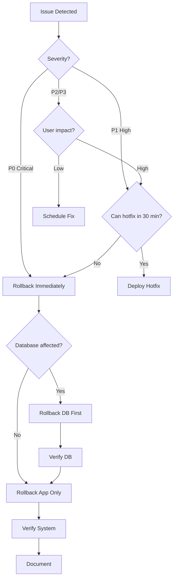

# Rollback Procedures

## Overview

This document provides detailed procedures for rolling back deployments and database changes in emergency situations.

## Table of Contents

- [Quick Reference](#quick-reference)
- [Application Rollback](#application-rollback)
- [Database Rollback](#database-rollback)
- [Complete System Rollback](#complete-system-rollback)
- [Emergency Contacts](#emergency-contacts)

## Quick Reference

### Severity Levels

| Level | Description | Action Time | Example |
|-------|-------------|-------------|---------|
| P0 - Critical | System down, data loss | Immediate | Database corruption, security breach |
| P1 - High | Major feature broken | < 15 min | Payment processing fails |
| P2 - Medium | Minor feature broken | < 1 hour | UI bug, non-critical feature |
| P3 - Low | Cosmetic issues | Next deploy | Text typo, color issue |

### Decision Matrix

```
Is the system down or data at risk?
├─ YES → P0 - Rollback immediately
└─ NO
   └─ Is core functionality broken?
      ├─ YES → P1 - Rollback within 15 min
      └─ NO
         └─ Can you hotfix in < 30 min?
            ├─ YES → Deploy hotfix
            └─ NO → P2/P3 - Rollback or defer
```

## Application Rollback

### Method 1: Vercel Dashboard (Recommended)

**Use Case**: Quick rollback for application issues

**Steps:**

1. **Access Vercel Dashboard**
   - Go to https://vercel.com/dashboard
   - Select your project
   - Click "Deployments" tab

2. **Find Previous Working Deployment**
   - Locate the last known good deployment
   - Check deployment timestamp
   - Review deployment logs if needed

3. **Promote Deployment**
   - Click the three dots (...) next to deployment
   - Select "Promote to Production"
   - Confirm the promotion

4. **Verify Rollback**
   ```bash
   # Check deployment
   curl -I https://supabase-admin.vercel.app

   # Test critical paths
   # - Login
   # - Dashboard load
   # - Key features
   ```

5. **Document Incident**
   - Create incident report
   - Document issue
   - Note rollback time
   - Plan fix for next deployment

**Time Estimate**: 2-5 minutes

### Method 2: Vercel CLI

**Use Case**: Command-line rollback, automation

**Steps:**

1. **Install Vercel CLI** (if not installed)
   ```bash
   npm install -g vercel
   ```

2. **Login to Vercel**
   ```bash
   vercel login
   ```

3. **Link Project**
   ```bash
   vercel link
   ```

4. **List Recent Deployments**
   ```bash
   vercel ls
   ```

5. **Rollback to Previous Deployment**
   ```bash
   # Automatic rollback to previous deployment
   vercel rollback

   # Or specify a deployment URL
   vercel promote <deployment-url> --scope <team-name>
   ```

6. **Verify Rollback**
   ```bash
   vercel inspect
   ```

**Time Estimate**: 3-7 minutes

### Method 3: Git Revert + Redeploy

**Use Case**: When specific commits need to be reverted

**Steps:**

1. **Identify Problematic Commit**
   ```bash
   cd /path/to/supabase-admin
   git log --oneline -10
   ```

2. **Create Revert Commit**
   ```bash
   # Revert single commit
   git revert <commit-hash>

   # Revert multiple commits
   git revert <commit-hash-1> <commit-hash-2>

   # Revert merge commit
   git revert -m 1 <merge-commit-hash>
   ```

3. **Push Revert**
   ```bash
   git push origin main
   ```

4. **Monitor Auto-Deployment**
   - GitHub Actions will trigger automatically
   - Monitor deployment in Actions tab
   - Check Vercel deployment status

5. **Verify Application**
   ```bash
   # Wait for deployment to complete
   # Test application functionality
   ```

**Time Estimate**: 5-15 minutes

## Database Rollback

### Prerequisites

- Database backup exists
- Database connection credentials
- Supabase CLI installed

### Method 1: Point-in-Time Recovery (Supabase)

**Use Case**: Recent database issues, data corruption

**Steps:**

1. **Access Supabase Dashboard**
   - Go to https://app.supabase.com
   - Select your project
   - Navigate to Database > Backups

2. **Select Recovery Point**
   - Review available backups
   - Select point in time before issue
   - Note the timestamp

3. **Initiate Recovery**
   - Click "Restore" on selected backup
   - Confirm restoration
   - Wait for process to complete

4. **Verify Database**
   ```bash
   # Connect to database
   psql $DATABASE_URL

   # Verify data
   SELECT COUNT(*) FROM users;
   SELECT COUNT(*) FROM tenants;

   # Check recent records
   SELECT * FROM audit_log ORDER BY created_at DESC LIMIT 10;
   ```

**Time Estimate**: 10-30 minutes (depends on database size)

### Method 2: Migration Rollback

**Use Case**: Bad migration applied

**Steps:**

1. **Identify Migration Version**
   ```bash
   # Check migration history
   cd /path/to/supabase-admin
   ls -la supabase/migrations/
   ```

2. **Create Rollback Migration**
   ```bash
   # Create new migration that reverses changes
   supabase migration new rollback_<description>
   ```

3. **Write Rollback SQL**
   ```sql
   -- Example: If original migration added a column
   -- Original: ALTER TABLE users ADD COLUMN new_column TEXT;
   -- Rollback:
   ALTER TABLE users DROP COLUMN new_column;

   -- Example: If original migration created a table
   -- Original: CREATE TABLE new_table (...);
   -- Rollback:
   DROP TABLE IF EXISTS new_table;
   ```

4. **Test Rollback Locally**
   ```bash
   # Start local Supabase
   supabase start

   # Apply migration
   supabase db reset

   # Verify changes
   supabase db diff
   ```

5. **Apply to Production**
   ```bash
   # Via GitHub Actions
   git add supabase/migrations/
   git commit -m "Rollback migration: <description>"
   git push origin main

   # Or manually
   supabase db push --db-url $DATABASE_URL
   ```

**Time Estimate**: 15-45 minutes

### Method 3: Manual SQL Rollback

**Use Case**: Emergency, specific data changes

**Steps:**

1. **Create Backup First**
   ```bash
   # Dump current state
   pg_dump $DATABASE_URL > backup_before_rollback.sql
   ```

2. **Connect to Database**
   ```bash
   psql $DATABASE_URL
   ```

3. **Begin Transaction**
   ```sql
   BEGIN;

   -- Your rollback statements here
   -- Example: Delete bad records
   DELETE FROM table_name WHERE created_at > '2025-11-17 12:00:00';

   -- Verify changes
   SELECT COUNT(*) FROM table_name;

   -- If satisfied, commit
   COMMIT;

   -- If not, rollback
   -- ROLLBACK;
   ```

4. **Verify Database State**
   ```sql
   -- Check critical tables
   SELECT COUNT(*) FROM users;
   SELECT COUNT(*) FROM tenants;

   -- Verify data integrity
   SELECT * FROM critical_table LIMIT 10;
   ```

**Time Estimate**: 10-30 minutes

## Complete System Rollback

**Use Case**: Both application and database need rollback

### Steps:

1. **Assess Situation** (1-2 min)
   - Identify issue severity
   - Determine rollback scope
   - Alert team

2. **Rollback Database First** (10-30 min)
   - Follow database rollback procedure
   - Verify database state
   - Document changes

3. **Rollback Application** (2-5 min)
   - Follow application rollback procedure
   - Wait for deployment
   - Verify application

4. **End-to-End Testing** (5-10 min)
   ```bash
   # Test critical paths
   # 1. User authentication
   # 2. Data retrieval
   # 3. Data modification
   # 4. Payment processing (if applicable)
   # 5. Search functionality
   ```

5. **Monitor** (ongoing)
   - Watch error logs
   - Monitor performance
   - Check user reports

6. **Document** (10-15 min)
   - Create incident report
   - Document root cause
   - Plan prevention measures

**Total Time Estimate**: 30-60 minutes

## Rollback Verification Checklist

### Application Verification

- [ ] Application loads successfully
- [ ] Login/authentication works
- [ ] Dashboard displays correctly
- [ ] API endpoints respond
- [ ] No console errors
- [ ] No broken UI elements
- [ ] Payment processing works (if applicable)
- [ ] Email notifications work
- [ ] Search functionality works

### Database Verification

- [ ] Database connection successful
- [ ] Record counts match expected
- [ ] Foreign key constraints intact
- [ ] No orphaned records
- [ ] Indexes functioning
- [ ] Query performance normal
- [ ] RLS policies active
- [ ] Recent data visible

### Full System Verification

- [ ] End-to-end user flows work
- [ ] No data inconsistencies
- [ ] Third-party integrations functional
- [ ] Monitoring alerts cleared
- [ ] Error rates normal
- [ ] Performance metrics acceptable

## Post-Rollback Actions

### Immediate (0-30 min)

1. **Notify Stakeholders**
   - Team members
   - Management (if needed)
   - Users (if customer-facing issue)

2. **Document Incident**
   - Create incident ticket
   - Document timeline
   - Note impact

3. **Monitor System**
   - Watch error rates
   - Monitor performance
   - Check user feedback

### Short-term (1-24 hours)

1. **Root Cause Analysis**
   - Investigate issue
   - Identify cause
   - Document findings

2. **Create Fix**
   - Develop solution
   - Test thoroughly
   - Code review

3. **Plan Redeployment**
   - Schedule deployment
   - Prepare rollback plan
   - Notify team

### Long-term (1-7 days)

1. **Post-Mortem**
   - Team meeting
   - Discuss learnings
   - Identify improvements

2. **Update Processes**
   - Improve testing
   - Update documentation
   - Enhance monitoring

3. **Prevent Recurrence**
   - Add safeguards
   - Improve CI/CD
   - Update procedures

## Emergency Contacts

### Escalation Path

```
L1: Developer on call
  ├─ Can't resolve in 15 min?
  └─ Escalate to L2

L2: Senior Developer / Tech Lead
  ├─ Can't resolve in 30 min?
  └─ Escalate to L3

L3: Engineering Manager / CTO
  ├─ Critical data loss?
  └─ Involve Data Team
```

### Contact Information

| Role | Contact Method | Response Time |
|------|---------------|---------------|
| On-Call Developer | Slack/Phone | Immediate |
| Tech Lead | Slack/Phone | < 15 min |
| DevOps | Email/Slack | < 30 min |
| Database Admin | Phone | < 15 min |
| CTO | Phone | < 30 min |

## Rollback Decision Tree



## Testing Rollback Procedures

### Quarterly Rollback Drill

Practice rollback procedures quarterly:

1. **Schedule drill** with team
2. **Simulate issue** in staging
3. **Execute rollback** following procedures
4. **Time the process**
5. **Document learnings**
6. **Update procedures**

### Staging Environment

Always test rollback in staging first:

```bash
# Test application rollback
vercel rollback --scope staging

# Test database rollback
supabase db push --db-url $STAGING_DATABASE_URL
```

## Additional Resources

- [Deployment Guide](./DEPLOYMENT.md)
- [Secrets Management](./SECRETS.md)
- [Vercel Rollback Documentation](https://vercel.com/docs/deployments/rollbacks)
- [Supabase Backup Documentation](https://supabase.com/docs/guides/platform/backups)
- [PostgreSQL Point-in-Time Recovery](https://www.postgresql.org/docs/current/continuous-archiving.html)

## Updates

This document should be reviewed and updated:
- After each rollback incident
- Quarterly as part of disaster recovery planning
- When deployment processes change
- When infrastructure changes

Last Updated: 2025-11-17
